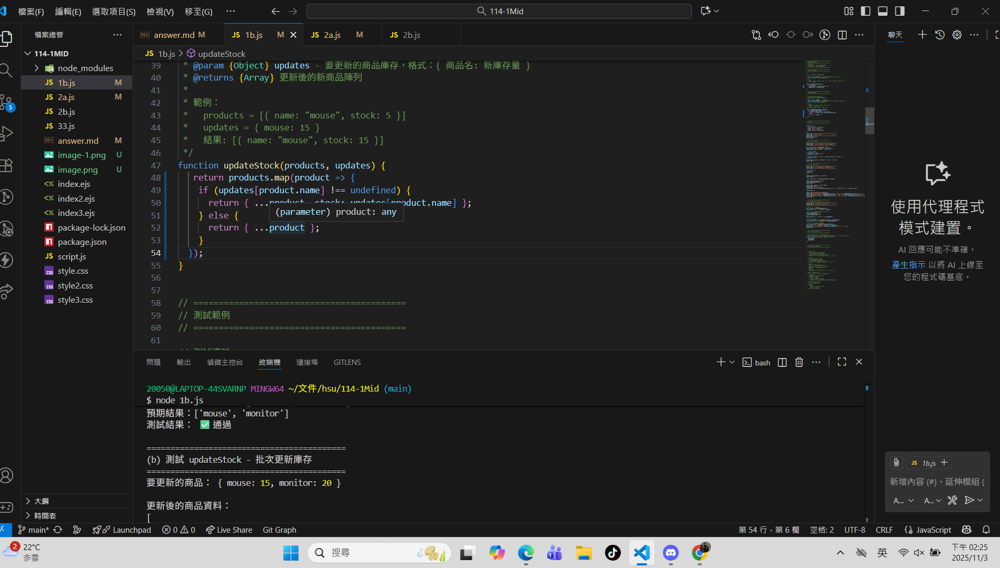
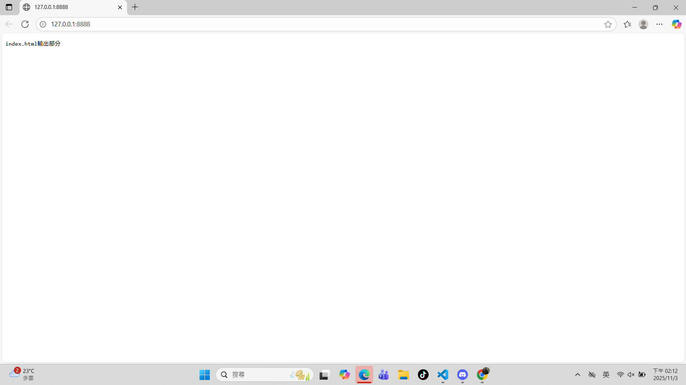

# 第2次隨堂題目-隨堂-QZ2
>
>學號：112111110   (學號和姓名都要寫)
> 
>姓名：徐子晴
>

1. a.

Ans: 

1. b.

Ans: 

這是我1b的答案

 

這是1b的截圖 

這是1b的截圖

<!-- 請撰寫時，最後一句話再寫一次 -->

1. c.

Ans: 

這是1c的答案 

這是1c的答案

這是1c的截圖

<!--  請撰寫時，第一句話再寫一次  -->

2. a. 

這是2a的答案

Ans:

這是2a的截圖

這是2a的答案

<!--  請撰寫時，第一句話再寫一次  -->

2. b.
這是2b的答案

Ans:

<!--  請撰寫時，第一句話再寫一次  -->

2. c. 

這是2c的檔案

Ans:

<!--  請撰寫時，第一句話和最後一句再寫一次  -->

2. d.

這是2d的答案

Ans:

